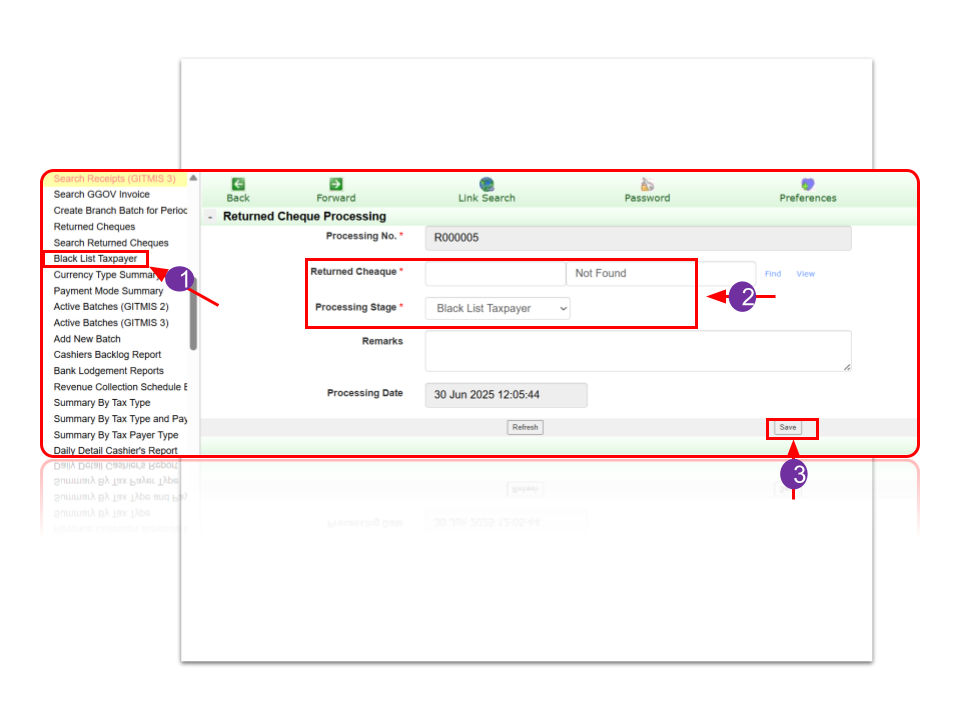
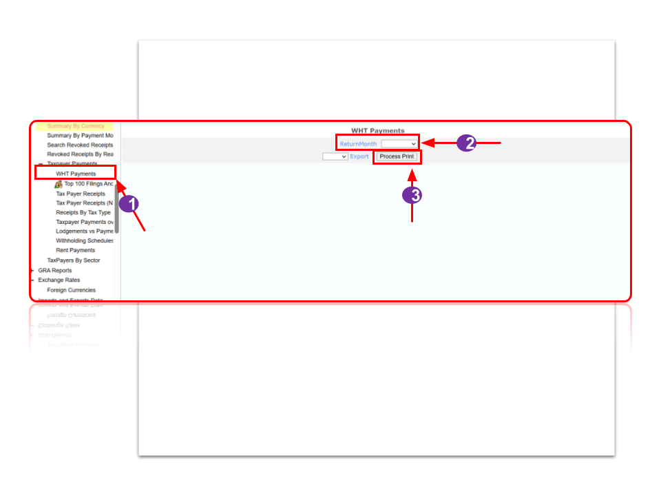
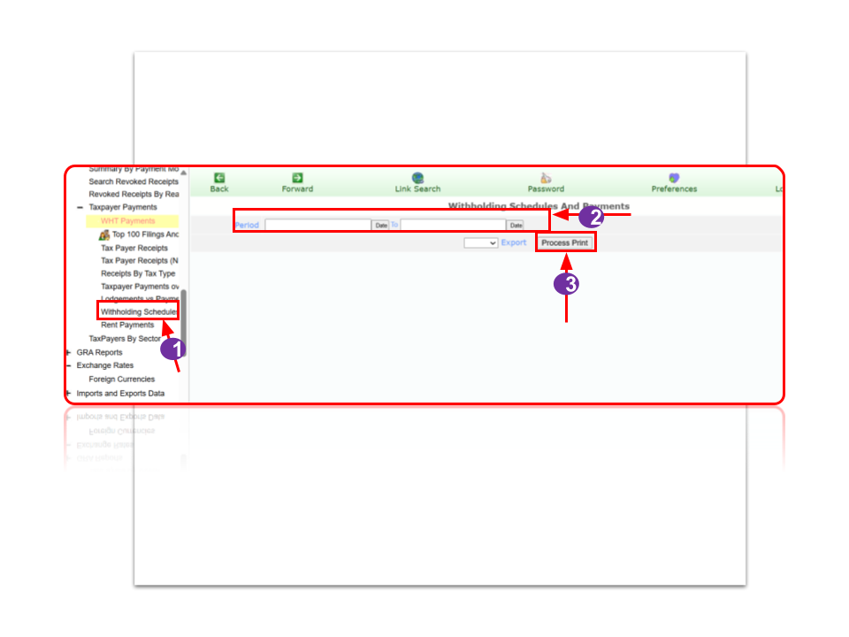

# Accountant

---

### TO LOG IN AS A CSO

**To sign into the system:**

1. Enter your Username and Password, then click the Login button to access the system.

**To reset your account:**

2. Click on Reset Password and follow the prompt to create a new one.

---

### PASSWORD RESET

**To reset your account, Enter your:**

1. Username and Password, then click the Reset Password button.

Check your GRA email for a verification email and follow the instructions to reset your password.

2. Click on Return to Login Page.

After resetting your password, return to the GITMIS 3 Login page and log in with your new password.

---

### CLEAN A TAXPAYER

**To clean a Taxpayer:**

1. Click on Clean a TaxPayer.

2. Enter the TIN number of the TaxPayer. The name of the TaxPayer should appear on the right.

3. Click on Process Print to print the TaxPayer information.

---

### ACCOUNTS

**Accountant Daily Report**

1. Click on Accountant Daily Report.

2. Select the Branch, Receipt Date From and Date To.

3. Click on Process Print. The results is displayed.

---

### ACCOUNTS

**Accountant Daily Online Report**

1. Click on Accountant Daily Online Report.

2. Select the Receipt and Date To.

3. Click on Process Print. The results is displayed.

---

### ACCOUNTS

**Ghana.GOV payments**

1. Click on Ghana.GOV payments.

2. Select the Period From, Period To and the Return type

3. Click on Process Print. The results is displayed.

---

### ACCOUNTS

**Summary By Tax Type Report:**

1. Click on Summary By Tax Type.

2. Fill in the details and Click on Process Print.

---

### ACCOUNTS

**Payments by date received:**

1. Click on Ghana.GOV payments by date received.

2. Select the Period From, Period To.

3. Click on Process Print. The results is displayed.

---

### ACCOUNTS

**Download Gh.Gov Report**

1. Click on Ghana.GOV payments by date received.

2. Select the Period From, Period To.

3. Click on Process Print. The results is displayed.

---

### ACCOUNTS

**Top Highest Payments**

1. Click on Top Highest Payments

2. Select the Period From, Period To.

3. Click on Process Print. The results is displayed.

---

### ACCOUNTS

**Process Receipts (GITMIS 2)**

1. Click on Process Receipt (GITMIS 2)

2. Enter the receipt number and the name.

3. Click on Process. The results is displayed.

---

### ACCOUNTS

**Process Receipts (GITMIS 3)**

1. Click on Process Receipt (GITMIS 3)

2. Enter the receipt number and the name.

3. Click on Process. The results is displayed.

---

### ACCOUNTS

**Search Receipts (GITMIS 2)**

1. Click on Search Receipt (GITMIS 2)

2. Enter the search parameters.

3. Click on Record Search. The results are displayed in the search results.

---

### ACCOUNTS

**Returned Cheques**

1. Click on Returned Cheques

2. Select an Item. Results will be displayed

---

### ACCOUNTS

**Search Returned Cheques Report:**

1. Click on Search Return Cheques.

2. Fill in the details and Click on Record Search.

---

### ACCOUNTS

**Black List Taxpayer:**

1. Click on Blacklist taxpayer.

2. Enter the returned charges and processing stage

3. Click on the save

---

### ACCOUNTS

**Currency Type Summary**

1. Click on currency type summary

2. Enter the period from and period to

3. Click on process print. The results are displayed.

---

### ACCOUNTS

**Payment Mode Summary:**

1. Click on Payment mode summary.

2. Enter the period from and period to.

---

### ACCOUNTS

**Active Batches:**

1. Click on active batches.

2. Enter the batchdate and batch info.

3. Click on save.

---

### ACCOUNTS

**Add New Batch:**

1. Click on active batches.

2. Enter the details.

3. Click on save.

---

### ACCOUNTS

**Cashiers Backlog Report:**

1. Click on Cashiers Backlog Report.

2. Enter the date from, date to, and payment mode.

3. Click on process print.

---

### ACCOUNTS

**Bank Lodgement Report:**

1. Click on Cashiers Backlog Report.

2. Select Browse Report and the results will be displayed.

---

### ACCOUNTS

**Revenue Collection Schedule:**

1. Click on Revenue Collection Schedule.

2. Select Receipt Date and To Date.

3. Click on Process Print

---

### ACCOUNTS

**Summary By Tax Type:**

1. Click on summary by tax type.

2. Select Receipt Date and To Date.

3. Click on Process Print

---

### ACCOUNTS

**Summary By Tax Payer Type:**

1. Click on summary by taxpayer type.

2. Select Receipt Date and To Date.

3. Click on Process Print

---

### ACCOUNTS

**Daily Detail Cashier’s Report:**

1. Click on daily detail cashier’s report.

2. Select a cashier’s report.

---

### Accounts

**Summarized Daily Cashier’s report:**

1. Click on summarized daily detail cashier’s report.

2. Select an item.

---

### ACCOUNTS

**Issue Tax Bill:**

1. Click on Issue Tax Bill.

2. Enter the TIN/GH-Card, total amount and bill detail.

3. Click on generate tax bill.

---

### ACCOUNTS

**Search Tax Bill:**

1. Click on search Tax Bill.

2. Enter the details.

3. Click on Record Search.

---

### GHANA CARD

**Search For Ghana Card:**

1. Click on search for Ghana Card

2. Select what to search with and enter either the Ghana card or TIN.

3. Click on Search.

---

### GHANA CARD

**TIN/GhCard Linked List:**

1. Click on TIN/GhCard Linked List:

2. Enter what to search for.

---

### TAXPAYER MANAGEMENT

**To open Taxpayers Folder:**

1. Click on open Taxpayers Folder.

2. Enter either of the fields and click search Taxpayer.

3. Click on the details to open the folder.

---

### TAXPAYER MANAGEMENT

1. The details of the Taxpayer displays.

2. The next processing action of the Taxpayer populates.

---

### OPEN TAXPAYER LEDGER

**To access a taxpayer's ledger:**

1. Enter the TIN (Taxpayer Identification Number) or GH Card number.

2. Click on Open Taxpayer Ledger

3. Select the relevant 'Tax Type and Assessment Year

This will grant you access to the taxpayer's ledger for viewing and management

---

### SEARCH TAXPAYER

1. Click on Search Taxpayer

2. Enter Taxpayer Number and name

3. Click Process

---

### ACCOUNT PERIOD LIST

1. Click on Account period list

---

### QUARTERLY TAXES

1. Click on quarterly taxes

2. Enter TIN/GH-CARD

3. Click generate report

---

### YEARLY VIT

1. Click on quarterly taxes

2. Enter TIN/GH-CARD and year of assessment

3. Click generate report

---

### VIEW VIT DETAIL

**To view details of a VIT:**

1. Click on View VIT Detail.

2. Enter the vehicle number.

3. Click on View Vit Detail.

---

### ADD VIT STICKER No. TO RECEIPT

**To add a VIT sticker no. to a receipt:**

1. Click on Add Vit Sticker No. to Receipt.

2. Enter the required details and select the necessary dropdowns.

3. Click on Save.

---

### SEARCH VALUE BOOKS

**To add search value books:**

1. Click on Search Value Book.

2. Fill details about search parameters.

3. Click record search.

---

### SEARCH BY SERIAL N0.

**To search by serial number:**

1. Click on search by serial number.

2. Enter the value book serial number start and value book serial number End.

3. Click on Process Print.

---

### VALUE BOOKS LIST

**Value books list:**

1. Click on value books list.

2. Select fieldname.

---

### ASSIGNED VALUE BOOKS

**Assigned value books:**

1. Click on assigned value books.

2. Select fieldname.

---

### REPORTS

**Daily Detail Cashier’s Report:**

1. Click on daily detail cashier’s report.

2. Select a cashier’s report.

---

### REPORTS

**SUMMARISED CASHIER’S REPORT:**

1. Click on summarized cashier’s report.

2. Select an item.

---

### REPORTS

**Summary by currency:**

1. Click on summary by currency.

2. Select a fieldName.

---

### REPORTS

**Summary by payment mode:**

1. Click on summary by payment mode.

2. Select an item.

---

### REPORTS

**Search Revoked Receipts:**

1. Click on search Revoked Receipt.

2. Fill in the details.

3. Click on generate report

---

### REPORTS

**Revoked Receipts By Reason:**

1. Click on revoked receipts by reason.

2. Select a fieldName.

---

### TAX PAYMENTS

**WHT Payments:**

1. Click on WHT Payments.

2. Select a Return Month.

3. Click process print.

---

### TAX PAYMENTS

**Top 100 Filings N Payments:**

1. Click on Top 100 Fillings N Payments.

2. Select a Return Month.

3. Click process print.

---

### TAX PAYMENTS

**TaxPayer Receipts:**

1. Click on taxpayer receipts.

2. Enter a TIN/GH-CARD.

3. Click on generate report

---

### TAX PAYMENTS

**Tax Payer Receipts(NEW):**

1. Click on Taxpayer Receipt(NEW).

2. Fill the details.

3. Click process print.

---

### TAX PAYMENTS

**Receipts By Tax Type:**

1. Click on receipts by tax type.

2. Select an item.

---

### TAX PAYMENTS

**Taxpayer Payments over Months:**

1. Click on taxpayer payments over months.

2. Select the tax type, from month to month, and the taxpayer number.

3. Click process print

---

### TAX PAYMENTS

**Lodgements vs Payments:**

1. Click on Lodgements vs payment

2. Select tax type, from month to month, and taxpayer number

3. Click process print

---

### TAX PAYMENTS

**Withholding Schedule and payments:**

1. Click on withholding schedule and payments.

2. Select a period from and period to.

3. Click on process print.

---

### TAX PAYMENTS

**Rent Payments:**

1. Click on rent payments.

2. Select a period from and period to.

3. Click on process print

---

### TAX PAYMENTS

**Taxpayers By Sectors:**

1. Click on Taxpayers by sectors.

2. Select an item.

---

### GRA REPORTS

**Statiscian Daily Report:**

1. Click on statiscian daily report.

2. Receipt Date and Receipt To.

3. Click process print.

---

### GRA REPORTS

**Accountant Daily Report**

1. Click on Accountant Daily Report.

2. Select the Branch, Receipt Date From and Date To.

3. Click on Process Print. The results is displayed.

---

### GRA REPORTS

**Top 10 incomeTax Payments:**

1. Click on Top 10 income Tax Payments.

2. Select a Receipt From and Receipt To.

3. Process print.

---

### GRA REPORTS

**Summary of monthly collection:**

1. Click on summary of monthly collection.

2. Select a Date From and Date To.

3. Click on process print.

---

### GRA REPORTS

**Monthly Income Tax of employees:**

1. Click on monthly income tax of employee.

2. Select a month.

3. Click process print.

---

### GRA REPORTS

**Monthly Income Tax of Self Employee By sectors:**

1. Click on monthly income tax of self employee by sectors.

2. Select a month.

3. Click process print. 

---

### GRA REPORTS

**Miscellaneous Taxes and Penalties:**

1. Click on miscellaneous taxes and penalties.

2. Select a month.

3. Click process print.

---

### GRA REPORTS

**Highest Income Tax Assessments(SR6):**

1. Click on highest income tax assessments(SR6).

2. Select a month.

3. Click process print.

---

### GRA REPORTS

**Highest Income Tax Payments(SR6B):**

1. Click on highest income tax payments(SR6B).

2. Select a month.

3. Click process print.

---

### GRA REPORTS

**Monthly Income Tax of newly opened files by sectors.**

1. Click on monthly income tax of newly opened files by sectors.

2. Select a month.

3. Click process print.

---

### GRA REPORTS

**Summary By Tax Type:**

1. Click on summary by tax type.

2. Select Receipt Date and To Date.

3. Click on Process Print

---

### GRA REPORTS

**Summary By Tax Payer Type:**

1. Click on summary by tax payer type.

2. Select Receipt Date and To Date.

3. Click on Process Print

---

### GRA REPORTS

**Monthly collection by sector:**

1. Click on monthly collection by sector.

2. Select Receipt Date and To Date.

3. Click on Process Print

---

### GRA REPORTS

**Collection by year of assessment:**

1. Click on collection by year of assessment.

2. Select Receipt Date and To Date.

3. Click on Process Print

---

### GRA REPORTS

**Collection by year of assessment detail:**

1. Click on collection by year of assessment detail.

2. Select Receipt Date and To Date.

3. Click on Process Print

---

### EXCHANGE RATES

**Foreign Currencies:**

1. Click on foreign currencies.

2. Select fieldname.

---

### IMPORTS AND EXPORTS DATA

**Report:**

1. Click on imports and exports data(Reports).

2. Enter on TIN/GH Card and Period.

3. Enter HSCode

4. Click view ICMUS Data.

---

### GITMIS ISSUES

**To file a complaint:**

1. Click on Add Complaint.

2. Fill in the details.

3. Click on Save.

---

### GITMIS ISSUES

**To view your complaints:**

1. Click on My Complaints.

2. The complaints made will be displayed.

