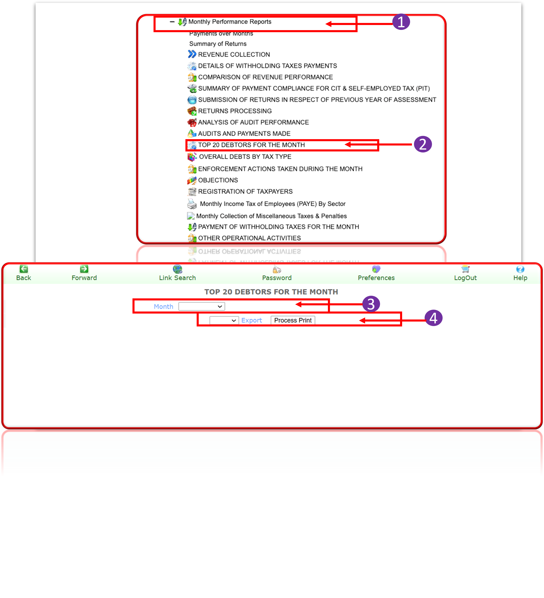

 STATICTICIAN MODULES

Welcome to the GITMIS User MODULE. This user guide is designed to provide documentation for people who will use GITMIS. This document is designed to be read by any user of GITMIS, as most users will have access to the features documented here.

## What Is GITMIS?
Ghana Integrated Tax Management and Information System (GITMIS) is an end-to-end Enterprise application developed to manage tax administration for the Ghana Revenue Authority.  
GITMIS 3 is a very capable Tax Information Management System that captures all aspects of Tax Administration in Ghana. GITMIS 3 makes use of the data points captured in the system to provide essential information for easy decision making.  

It is basically a management and decision support system. The focus of GITMIS 3 is to determine or predict the Tax Compliance of taxpayers in a more targeted manner using the easily accessible data. As no efficient tax management system works in isolation, GITMIS 3 is designed and developed with integration and interoperability as one of the core considerations.  

---
# TO LOG IN AS A SATISTICIAN  
## To Sign into the System:
1. Enter your **Username** and **Password** then click the **Login** button to access the system

## To reset your account: 
2. Click on **Reset Password** and follow the prompt to create a new one.  

---

# PASSWORD RESET
## To reset your account, Enter your:
1. Username and Password, then click the **Reset Password** button.
 
 
Check your GRA email for a verification email and follow the instructions to reset your password.

2. Click on **Return to Login Page**.

 
 
After resetting your password, return to the GITMIS 3 Login page and log in with your new password.   

---
  
## Taxpayer Data Cleansing

**Only specifically designated profiles are authorized to perform these processing actions.**  

1. Select any of the buttons to complete the next processing action  
1. Click on **Clean a Taxpayer**, fill in the **Taxpayer Identification Number**, and click **Process Print**  

 
 Access to the **Taxpayer Data Cleansing** and **Clean a Taxpayer** menu is restricted.You must be explicitly authorized by the **GRA content/images/satistician/IT Unit** to use these features  

---

## Taxpayer Folder
### To Open Taxpayer :
1. Click on **Open Taxpayers Folder**  
2. Enter either of the fields and click **Search Taxpayer**  
3. Click on the details to open the folder.

---
1. The details of the Taxpayer displays  
1. The next processing action of the Taxpayer populates  

---

## OPEN TAXPAYER LEDGER
To access a taxpayer's ledger:  
1. Enter the **TIN (Taxpayer Identification Number)** or **GH Card number**  
2. Click on **Open Taxpayer Ledger**  
3. Select the relevant **Tax Type** and **Assessment Year** 
    
 
 This will grant you access to the taxpayer's ledger for viewing and management.

---

## TAXPAYER INFO
### Search Taxpayer
1. Search **Taxpayer**, this allows you to search for a taxpayer using the necessary credentials
2. Fill in the taxpayer details
3. click **Search Taxpayer**.
  

---

# STATISTICIAN REPORTS

## Statistician Daily Reports
1. To view the Statistician Reports, first click on , **Reports** then **Statistician Reports**
2. Click on **Statistician daily reports**, Provide the required information
3. click on **Process Print** to generate the reports.
 

---

## Account Daily Report
1. To view the **Account Daily Report**, first click on , Reports then Statistician Reports.
2. Click on **Accountant daily report**, fill from date-to-date section.
3. click on **Process Print** to generate the reports.
   

    This is a picture of a processed print of the account daily report  
    
---

## Top 10 Income Tax Payments
1. To view the Top Income Tax Payments, first click on , Reports then **Statistician Reports**.
2. Click on **Top 10 income Tax Payments**, fill in the date- to- date  section then,
3.  click on **Process Print** to generate the reports
 
 This is picture of the process print of the Top 10 income tax payments.
 

---

## Summary of Monthly Collection (SR1)
1. To view the Summary of Monthly Collection (SR1), first click on , **Reports**, then **Statistician Reports**.
2. Click on **Summary of Monthly Collection**, fill in the date from -to date section.
3. click on **Process Print** to generate the reports

This is picture of the process print of the summary of monthly collection(SR1) report.

---

## Monthly Income Tax of Employees (P.A.Y.E) by Sectors (SR2)
1. To view the Monthly Income Tax Employees, first click on , **Reports then Statistician Reports**.
2. Click on **Monthly Income Tax of Employees**, then click and select the month.
3. click on Process Print to generate the reports
  
    
This is the picture of the Monthly Income Tax of Employees (P.A.Y.E) by sectors(SR2) report.

---

## Monthly Income Tax of Companies (P.A.Y.E) by Sectors (SR3):
1. To view the Monthly Income Tax of Companies (P.A.Y.E) by Sectors (SR3), first click on, Reports then Statistician Reports.
2. Click on Monthly Income Tax of Companies (P.A.Y.E) by Sectors (SR3),select and fill in the month.
3. click on Process Print to generate the reports

Monthly Income tax of Employees by sectors processed print.

---

## Monthly Income Tax of Self Employed by Sectors (SR4):
1. To view the Monthly Income Tax of Self Employed , first click on , Reports then Statistician Reports.
2. Click on Monthly Income Tax of Self Employed, 
3. click on Process Print to generate the reports.
 

Monthly income tax of self employed by sectors print.

---

## Miscellaneous Taxes & Penalties (SR5)
1. To view the Miscellaneous Taxes & Penalties, first click on , **Reports **then **Statistician Reports**.
2. Click on **Miscellaneous Taxes & Penalties**, select the month and then  
3.  click on **Process Print** to generate the reports
  
Miscellaneous Taxes and penalties processed print.

---

## Highest Income Tax Assessment (SR6)
1. To view the Highest Income Tax Assessment, first click on **Reports** then **Statistician Reports**.
 
2. Click on **Highest Income Tax Assessment** and select the **month** and proceed to **3**.
  
3.  click on **Process Print** to generate the reports
  

A picture of the processed print of Highest Income tax assessment.

---

## Highest Income Tax Payments (SR6B)
1. To view the highest income tax payments, first click on , **Reports** then **Statistician Reports**.
2. Click on **highest income tax payments**, select the month.  
3.  click on **Process Print** to generate the reports  
.png>)  

A picture of a printout of the highest income tax payment. 

---

## Monthly Income Tax of New Opened Files by Sectors (SRS)
1. To view the Monthly Income Tax of New Opened Files, first click on , **Reports** then **Statistician Reports**. 
2. Click on M**onthly Income Tax of New Opened Files**, select the month.    
3. click on **Process Print** to generate the reports 
.png>)

The printout of the monthly income tax of new opened files by sectors
.png>)
---

## Collection Summary by Tax Type
1. To view the Collection Summary By Tax Type, first click on , **Reports then Statistician Reports**.
2. Click on **Collection Summary By Tax Type**, select the date-to date.
3. click on **Process Print** to generate the reports

this is how the printout of the collection summary by tax type look like.

---

## Collection Summary by Taxpayer Type

1. To view the Collection Summary By Taxpayer Type, first click on , **Reports then Statistician Reports**.
2. Click on **Collection Summary By Taxpayer Type**, type in the date-to –date.
3. click on **Process Print** to generate the reports
 
this is how the printout of the collection summary by taxpayer type looks like.

---

## Monthly Collection by Sector
1. To view the Monthly Collection by Sector, first click on , Reports then Statistician Reports.
2. Click on Monthly Collection by Sector, select the date –to – date.
3. click on Process Print to generate the reports
 
A printout of how the monthly collection by sector looks like.

---

## Collection by Year of Assessment
1. To view the Collection by year of Assessment, first click on , Reports then Statistician Reports.
  
2. Click on Collection by year of Assessment, select date –to –date then
  
3.  click on Process Print to generate the reports
  
A printout of how the collection by year of assessment looks like.

---

## Collection by Year of Assessment Detail
1. To view the collection by year of assessment, first click on , **Reports** then **Statistician Reports**.
  
2. Click on **collection by year** of assessment, select the **date –to- date** then
  
3.  click on Process Print to generate the reports
 
This is how the process print looks like.

---

# MONTHLY PERFORMANCE REPORTS

## Payments Over Months
1. To view the Payments over months, first click on **Reports** then **Monthly Performance Reports**.
  
2. Click **Payments over months**.
  
3.  Provide the required information 
 
4. click on **Process Print** to generate the reports.
  
1. Click the dropdown option to select the tax type.

---
## Summary Returns
1. To view the Summary Returns first click on **Reports** then **Monthly Performance Reports**.
 
2. Click S**ummary of Returns**.
  
3.  Select and Provide the required information 
  
4. cick on **Process Print** to glenerate the reports.
  
This is how the process print looks like.

---
## Revenue Collection
1. To view the Revenue Collection, first click on **Reports** then **Monthly Performance Reports**.
  
2. Click **Revenue Collection**.
  
3.  Select the month 
  
4. click on **Process Print** to generate the reports.
  
This how the process print looks like.

---
## Details of withholding Taxes Payments:
1. To view the Details of withholding Taxes payments, first click on Reports then Monthly Performance Reports.
2. Click Details of withholding Taxes payments.
3. select the month then,
4. click on Process Print to generate the reports.
   
This is how the process print look like.

---
## Comparison of Revenue Performance
1. To view the above mentioned, first click on Reports then Monthly Performance Reports.
2. Click Comparison of Revenue performance.
3. Select the drop down by the month and provide the required information 
4. click on Process Print to generate the reports.
   
A printout of how the comparison of revenue performance looks like.

---
## Summary of Payment Compliance for CIT & Self-Employed Tax(PIT):
1. To view the above mentioned, first click on Reports then Monthly Performance Reports.
2. Click Summary of payments Compliance for CIT.
3. select the dropdown by the month and then,
4. click on Process Print to generate the reports.
.png>)
This is how a process print out looks like.
 1.png>)
---
##  Submission Of Returns in Respect of Previous Year of Assessment
1. To view the submission of returns in respect of previous year of assessment, first click on reports then monthly performance reports.
2. Click submission of returns in respect of previous year of assessment.
3. Select the dropdown by the month then,
4. Click on Process Print to generate the reports.

A printout of how the submission of returns in respect of previous year of assessment looks like.

---
## Returns Processing
1. To view the Returns Processing, first click on Reports then Monthly Performance Reports.
2. Click Details of Returns Processing.
3. Select the dropdown by the month, 
4. Click on Process Print to generate the reports.

This is how a process print out looks like.

---
## Analysis Of Audit Performance
1. To view the Analysis of Audit Performance, first click on Reports then Monthly Performance Reports.
2. Click Details of Analysis of Audit Performance
3. Select the drop down by the month,
4. click on Process Print to generate the reports.

This is how a process print out looks like.

---
##  Audits And Payments made:
1. To view the Audits and payments made, first click on Reports then Monthly Performance Reports.
2. Click Details of Audit sand payments made.
3. Provide the required information 
4. click on Process Print to generate the reports.

This is how a process print out looks like.

# Top 20 Debtors for the Month
1. To view the Top 20 Debtors for the Month, first click on Reports then Monthly Performance Reports.
2. Click Top 20 Debtors for the Month.
Select the dropdown by the month.
3. Select the dropdown by the month.
4. click on Process Print to generate the reports.
